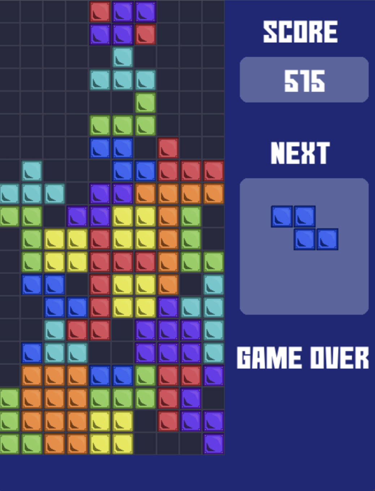

# Python Tetris Game
With the help of some tutorials, I coded a tetris game with pygame. The purpose of this project was to learn a practical application of object oriented programming. 



## Controls

KEY DOWN - soft drop

KEY LEFT/RIGHT - move block left/right

SPACEBAR - rotate block

## Requesites
Before running the game make sure that you have python and pygame installed.

```
pip install pygame 
```

Then run the script in python

```
python tetris.py
```

### for macOS 

If you use macOS you can just start tetris.app and the game will run for you